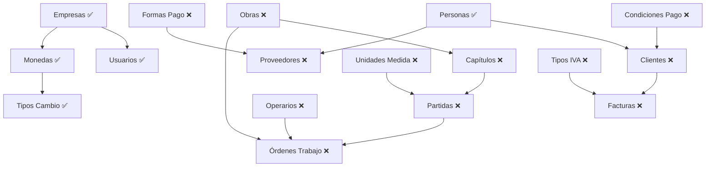

# 🗺️ Mapeo Módulos Backend ↔️ Frontend

## 📊 Estado General de Implementación

| Módulo Backend | Archivo Backend | Estado Frontend | Servicio | Componentes | Prioridad |
|----------------|-----------------|-----------------|----------|-------------|----------|
| **SEGURIDAD** | | | | | |
| Usuarios | `usuarios.md` | ✅ **Completo** | ✅ | ✅ Lista, Dialog | Alta |
| Roles | `roles.md` | ✅ **Completo** | ✅ | ✅ Lista, Dialog | Alta |
| Permisos | `permisos.md` | ❌ **Faltante** | ❌ | ❌ | Alta |
| Roles-Permisos | `rolespermisos.md` | ❌ **Faltante** | ❌ | ❌ | Alta |
| Usuarios-Roles | `usuariosroles.md` | ❌ **Faltante** | ❌ | ❌ | Alta |
| **CONFIGURACIÓN** | | | | | |
| Empresas | `empresas.md` | ✅ **Completo** | ✅ | ✅ Lista, Dialog | Alta |
| Monedas | `monedas.md` | ✅ **Completo** | ✅ | ✅ Lista, Dialog | Alta |
| Tipos Cambio | `tiposcambio.md` | ✅ **Completo** | ✅ | ✅ Lista, Dialog | Alta |
| Series Documentales | `seriesdocumentales.md` | ✅ **Completo** | ✅ | ✅ Lista, Dialog | Alta |
| Centros Coste | `centroscoste.md` | ❌ **Faltante** | ❌ | ❌ | Alta |
| Condiciones Pago | `condicionespago.md` | ❌ **Faltante** | ❌ | ❌ | Alta |
| Formas Pago | `formaspago.md` | ❌ **Faltante** | ❌ | ❌ | Alta |
| Unidades Medida | `unidadesmedida.md` | ❌ **Faltante** | ❌ | ❌ | Alta |
| Tipos IVA | `tiposiva.md` | ❌ **Faltante** | ❌ | ❌ | Alta |
| Descuentos | `descuentos.md` | ❌ **Faltante** | ❌ | ❌ | Media |
| **TERCEROS** | | | | | |
| Personas | `personas.md` | ✅ **Completo** | ✅ | ✅ Lista, Dialog, Detalle | Alta |
| Clientes | `clientes.md` | ❌ **Faltante** | ❌ | ❌ | Alta |
| Proveedores | `proveedores.md` | ❌ **Faltante** | ❌ | ❌ | Alta |
| **PRODUCTOS** | | | | | |
| Productos | `productos.md` | ✅ **Completo** | ✅ | ✅ Lista, Dialog | Alta |
| Artículos | `articulos.md` | ✅ **Completo** | ✅ | ✅ Lista, Dialog | Alta |
| Desglose Producto | `desgloseproducto.md` | ❌ **Faltante** | ❌ | ❌ | Media |
| **OBRAS Y CONSTRUCCIÓN** | | | | | |
| Obras | `obras.md` | ❌ **Faltante** | ❌ | ❌ | Alta |
| Capítulos | `capitulos.md` | ❌ **Faltante** | ❌ | ❌ | Alta |
| Partidas | `partidas.md` | ❌ **Faltante** | ❌ | ❌ | Alta |
| Operarios | `operarios.md` | ❌ **Faltante** | ❌ | ❌ | Alta |
| Órdenes Trabajo | `ordenestrabajo.md` | ❌ **Faltante** | ❌ | ❌ | Alta |
| **PRESUPUESTOS** | | | | | |
| Líneas Presupuesto | `lineaspresupuesto.md` | ❌ **Faltante** | ❌ | ❌ | Media |
| **COMERCIAL** | | | | | |
| Facturas | `facturas.md` | ❌ **Faltante** | ❌ | ❌ | Media |

## 📈 Estadísticas de Implementación

- **Total módulos backend**: 30
- **Módulos implementados**: 9 (30%)
- **Módulos faltantes**: 21 (70%)
- **Prioridad Alta faltante**: 15 módulos
- **Prioridad Media faltante**: 6 módulos

## 🎯 Análisis Detallado por Área

### 🔒 SEGURIDAD (60% implementado)

#### ✅ Implementado:
- **Usuarios** (`usuarios.md`)
  - Service: `usuarios.service.ts`
  - Components: `usuarios.component.ts`, `usuario-dialog.component.ts`
  - Features: CRUD, filtros, paginación, RBAC

- **Roles** (`roles.md`)
  - Service: `roles.service.ts`
  - Components: Integrado en usuarios
  - Features: Gestión básica de roles

#### ❌ Faltante (PRIORIDAD ALTA):
- **Permisos** (`permisos.md`)
  - Endpoints: CRUD permisos, jerarquía
  - UI Necesaria: Lista permisos, asignación por módulo
  - Estimación: 1 semana

- **Roles-Permisos** (`rolespermisos.md`)
  - Endpoints: Asignación permisos a roles
  - UI Necesaria: Matriz permisos-roles, drag & drop
  - Estimación: 1 semana

- **Usuarios-Roles** (`usuariosroles.md`)
  - Endpoints: Asignación roles a usuarios
  - UI Necesaria: Multi-select roles en usuario
  - Estimación: 3 días

### ⚙️ CONFIGURACIÓN (50% implementado)

#### ✅ Implementado:
- **Empresas** - Completo con multi-tenancy
- **Monedas** - CRUD completo
- **Tipos Cambio** - Con importación CSV
- **Series Documentales** - Gestión completa

#### ❌ Faltante (PRIORIDAD ALTA):
- **Centros Coste** (`centroscoste.md`)
  - Endpoints: CRUD, jerarquía, asignaciones
  - UI Necesaria: Árbol jerárquico, drag & drop
  - Estimación: 1 semana

- **Condiciones Pago** (`condicionespago.md`)
  - Endpoints: CRUD, cálculos de vencimientos
  - UI Necesaria: Formulario con cálculos automáticos
  - Estimación: 4 días

- **Formas Pago** (`formaspago.md`)
  - Endpoints: CRUD, integración SEPA
  - UI Necesaria: Configuración SEPA, validaciones
  - Estimación: 1 semana

- **Unidades Medida** (`unidadesmedida.md`)
  - Endpoints: CRUD, conversiones
  - UI Necesaria: Tabla conversiones, calculadora
  - Estimación: 3 días

- **Tipos IVA** (`tiposiva.md`)
  - Endpoints: CRUD, cálculos fiscales
  - UI Necesaria: Configuración por país, validaciones
  - Estimación: 4 días

### 👥 TERCEROS (33% implementado)

#### ✅ Implementado:
- **Personas** - CRUD completo con direcciones y cuentas bancarias

#### ❌ Faltante (PRIORIDAD ALTA):
- **Clientes** (`clientes.md`)
  - Endpoints: CRUD, vinculación personas, códigos automáticos
  - UI Necesaria: Selector personas, configuración códigos
  - Dependencias: Personas (✅), Condiciones Pago (❌)
  - Estimación: 1.5 semanas

- **Proveedores** (`proveedores.md`)
  - Endpoints: CRUD, evaluación, homologación
  - UI Necesaria: Sistema evaluación, workflow homologación
  - Dependencias: Personas (✅), Formas Pago (❌)
  - Estimación: 2 semanas

### 📦 PRODUCTOS (67% implementado)

#### ✅ Implementado:
- **Productos** - CRUD completo con categorías
- **Artículos** - Gestión completa

#### ❌ Faltante (PRIORIDAD MEDIA):
- **Desglose Producto** (`desgloseproducto.md`)
  - Endpoints: BOM (Bill of Materials), componentes
  - UI Necesaria: Árbol componentes, cálculos automáticos
  - Estimación: 1 semana

### 🏗️ OBRAS Y CONSTRUCCIÓN (0% implementado)

#### ❌ Faltante (PRIORIDAD ALTA):
- **Obras** (`obras.md`)
  - Endpoints: CRUD obras, estados, seguimiento
  - UI Necesaria: Dashboard obras, timeline, KPIs
  - Estimación: 2 semanas

- **Capítulos** (`capitulos.md`)
  - Endpoints: CRUD, jerarquía por obra
  - UI Necesaria: Árbol jerárquico, drag & drop
  - Dependencias: Obras (❌)
  - Estimación: 1 semana

- **Partidas** (`partidas.md`)
  - Endpoints: CRUD, vinculación capítulos, mediciones
  - UI Necesaria: Formulario complejo, calculadora
  - Dependencias: Capítulos (❌), Unidades Medida (❌)
  - Estimación: 1.5 semanas

- **Operarios** (`operarios.md`)
  - Endpoints: CRUD, categorías, disponibilidad
  - UI Necesaria: Calendario disponibilidad, skills
  - Estimación: 1 semana

- **Órdenes Trabajo** (`ordenestrabajo.md`)
  - Endpoints: CRUD, asignaciones, seguimiento
  - UI Necesaria: Kanban board, timeline, notificaciones
  - Dependencias: Obras (❌), Operarios (❌), Partidas (❌)
  - Estimación: 2 semanas

### 💰 PRESUPUESTOS (20% implementado)

#### 🟡 Parcial:
- Componentes básicos implementados

#### ❌ Faltante (PRIORIDAD MEDIA):
- **Líneas Presupuesto** (`lineaspresupuesto.md`)
  - Endpoints: CRUD líneas, cálculos automáticos
  - UI Necesaria: Tabla editable, totalizadores
  - Dependencias: Partidas (❌), Productos (✅)
  - Estimación: 1 semana

### 💼 COMERCIAL (0% implementado)

#### ❌ Faltante (PRIORIDAD MEDIA):
- **Facturas** (`facturas.md`)
  - Endpoints: CRUD, generación PDF, envío email
  - UI Necesaria: Editor facturas, preview PDF
  - Dependencias: Clientes (❌), Tipos IVA (❌)
  - Estimación: 2 semanas

## 🔄 Dependencias entre Módulos

## 📋 Orden de Implementación Recomendado

### **FASE 1: Configuración Base** (3-4 semanas)
1. **Centros Coste** (1 semana)
2. **Condiciones Pago** (4 días)
3. **Formas Pago** (1 semana)
4. **Unidades Medida** (3 días)
5. **Tipos IVA** (4 días)

### **FASE 2: Seguridad Completa** (2 semanas)
1. **Permisos** (1 semana)
2. **Roles-Permisos** (1 semana)
3. **Usuarios-Roles** (3 días - paralelo)

### **FASE 3: Terceros Completos** (3-4 semanas)
1. **Clientes** (1.5 semanas) - Requiere Condiciones Pago
2. **Proveedores** (2 semanas) - Requiere Formas Pago

### **FASE 4: Obras y Construcción** (6-7 semanas)
1. **Obras** (2 semanas)
2. **Capítulos** (1 semana) - Requiere Obras
3. **Partidas** (1.5 semanas) - Requiere Capítulos + Unidades Medida
4. **Operarios** (1 semana)
5. **Órdenes Trabajo** (2 semanas) - Requiere todo lo anterior

### **FASE 5: Comercial y Avanzado** (4-5 semanas)
1. **Líneas Presupuesto** (1 semana)
2. **Facturas** (2 semanas)
3. **Desglose Producto** (1 semana)
4. **Descuentos** (1 semana)

## 🎯 Criterios de Priorización

### **Prioridad Alta** (15 módulos):
- Módulos base requeridos por otros
- Funcionalidad core del ERP
- Dependencias críticas

### **Prioridad Media** (6 módulos):
- Funcionalidad avanzada
- Módulos independientes
- Optimizaciones y mejoras

## 📊 Estimación Total

- **Tiempo total estimado**: 18-22 semanas
- **Desarrolladores recomendados**: 2-3 frontend
- **Sprints de 2 semanas**: 9-11 sprints
- **Puntos de historia estimados**: 180-220 puntos

---

**Versión**: 1.0  
**Fecha**: Enero 2025  
**Actualizado**: Análisis completo backend ↔️ frontend